# システム仕様書（概要と UML）

この文書は、DeepFilterTool の構造と振る舞いを Mermaid による UML 図で示す。GitHub は Mermaid のコードブロックを図として表示するので、図はリポジトリ上でそのまま読める。モジュールごとの実装の詳細は [コードマップ](CODEMAPS/architecture.md) にある。

## 目次

1. [システム概要](#1-システム概要)
2. [システム境界（コンテキスト図）](#2-システム境界コンテキスト図)
3. [ユースケース](#3-ユースケース)
4. [構造](#4-構造)
5. [振る舞い（シーケンス図）](#5-振る舞いシーケンス図)
6. [状態遷移](#6-状態遷移)
7. [アクティビティ](#7-アクティビティ)
8. [配置](#8-配置)
9. [データ仕様](#9-データ仕様)
10. [エラー処理](#10-エラー処理)
11. [非機能要件](#11-非機能要件)
12. [品質保証（CI）](#12-品質保証ci)

---

## 1. システム概要

### 1.1 目的

録音された WAV ファイルからノイズを取り除く。ノイズ除去の計算は、DeepFilterNet プロジェクトが配布する Rust 製のコマンドラインプログラム `deep-filter`（以下、エンジン）が、公式モデル DeepFilterNet3 を使って行う。本ツールは**ノイズ除去の計算をせず**、エンジンの前後の処理だけを受け持つ。

### 1.2 本ツールが担うこと

| 責務 | 内容 |
|---|---|
| 入力検証 | 48 kHz / 1〜2 ch / PCM16 または Float32 の WAV だけを受け付ける |
| 前処理 | 入力を作業フォルダーへ複製し、末尾に無音を足す（パディング） |
| エンジン起動 | エンジンを別プロセスとして起動する |
| 後処理 | 出力を PCM16 へ変換し、元のフレーム数へ切り詰める |
| 導入（CLI のみ） | エンジンとモデルを取得し、サイズと SHA-256 を照合して配置する |

### 1.3 二つの実装

| | GUI 版 | CLI 版 |
|---|---|---|
| 実行ファイル | `DeepFilterTool.exe` | `deepfilter-tool` |
| 言語 | C# / WinForms（.NET Framework） | Rust（標準ライブラリのみ） |
| 対応 OS | Windows | Windows / Linux / macOS |
| ソース | `gui/App.cs`、`gui/AudioCore.cs` | `cli/src/*.rs` |
| エンジンの導入 | 手動（README の手順） | `setup` サブコマンド |

二つの実装はコードを共有せず、WAV の検証規則・パディング量・変換式を揃えて別々に書いてある。同じ入力に対して、パディング済みの中間ファイルはバイト単位で一致する。最終出力は、Windows の GUI 版と Linux の CLI 版の比較で最大 1 LSB 異なる。エンジンが OS ごとに別々にビルドされており、浮動小数点演算の結果がわずかに異なるためである（[検証記録](VERIFICATION.md)）。

### 1.4 主な制約

- 外部パッケージへの依存はゼロ（crates.io・NuGet・npm のいずれも使わない）
- 音声データはネットワークに出ない。通信は CLI の `setup` だけ
- 元ファイルは変更しない。出力は元と同じ長さ・同じ時間位置

---

## 2. システム境界（コンテキスト図）

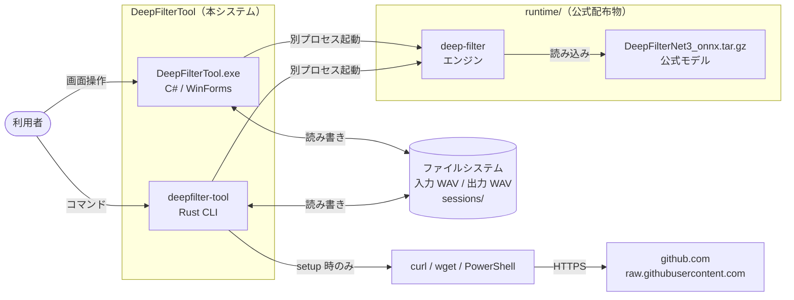

| 境界 | やり取り | 備考 |
|---|---|---|
| 本体 → エンジン | コマンドライン引数のみ | 入力は常に固定名 `input.wav` で渡す |
| 本体 → ネットワーク | CLI の `setup` だけ | 取得ツールを絶対パスで起動。HTTPS 以外は拒否 |
| 本体 → ディスク | `runtime/`（読み取り）、`sessions/`（作業）、出力先 | 既存ファイルは上書きしない |

---

## 3. ユースケース

Mermaid にはユースケース図がないため、フローチャートで代用する。

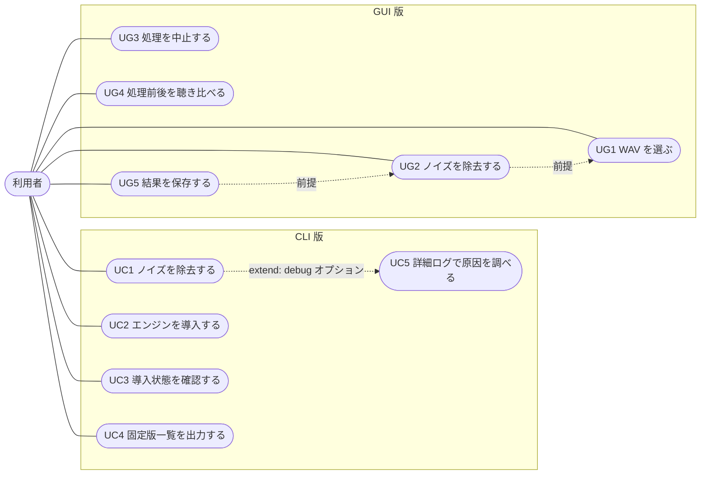

UG2 と UG5 から出る点線は、UML の include（呼び出し元の一部として必ず実行される）ではなく、事前に済ませておく操作を示す。WAV を選んでいなければ除去は失敗し、除去が成功するまで保存ボタンは押せない。

| ID | ユースケース | コマンド・操作 |
|---|---|---|
| UC1 | ノイズを除去する | `deepfilter-tool [filter] <入力.wav> [-o 出力] [-a dB] [--pf]` |
| UC2 | エンジンを導入する | `deepfilter-tool setup [--platform P] [--force]` |
| UC3 | 導入状態を確認する | `deepfilter-tool check` |
| UC4 | 固定版一覧を出力する | `deepfilter-tool manifest` |
| UC5 | 詳細ログで原因を調べる | `--debug`、または環境変数 `DEEPFILTER_DEBUG` に空でも `0` でもない値を設定 |
| UG1〜UG5 | GUI の各操作 | 「WAVを選択」「ノイズを除去」「中止」「再生」「名前を付けて保存」 |

---

## 4. 構造

### 4.1 コンポーネント図

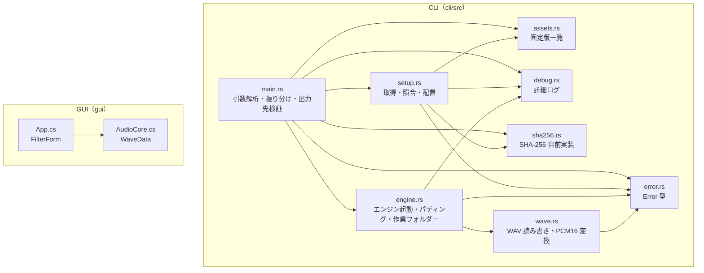

CLI のモジュール間の依存に循環はない。`assets`、`sha256`、`debug`、`error` はほかのモジュールに依存しない。

GUI の `AudioCore.cs` は CLI の `wave.rs` に対応し、同じ規則で WAV を検証して、同じバイト列を書き出す。

### 4.2 クラス図（CLI）

Rust の構造体と、モジュール単位の関数をクラスとして表す。`<<module>>` はモジュール、`+` は公開、`-` は非公開。

```mermaid
classDiagram
    class main {
        <<module>>
        -dispatch() Result
        -setup_command(args) Result
        -check_command() Result
        -filter_command(args) Result
        -check_output_name(output) Result
        -default_output(input) PathBuf
        -same_file(a, b) bool
    }

    class engine {
        <<module>>
        +ENGINE_FILE: str
        +MODEL_FILE: str
        -HOP: usize = 480
        -TAIL_PAD: usize = 4800
        +platform_key() str
        +find_root() PathBuf
        +engine_path(root) PathBuf
        +model_path(root) PathBuf
        +check_runtime(engine, model) Result
        +new_session(root) PathBuf
        +run(job) Outcome
    }

    class Job {
        +input: Path
        +engine: Path
        +model: Path
        +session: Path
        +attenuation: u32
        +post_filter: bool
        +verbose: bool
    }

    class Outcome {
        +result: PathBuf
        +log: PathBuf
        +frames: usize
        +channels: u16
    }

    class Wave {
        +format: u16
        +channels: u16
        +rate: u32
        +align: u16
        +bits: u16
        +data: Vec~u8~
        +frames() usize
        +read(path)$ Wave
        +convert_to_pcm16() Result
        +write(path, frames, pad) Result
    }

    class setup {
        <<module>>
        +run(root, platform, force) Result
        -install(runtime, asset, executable, force) bool
        -download(url, dest) Result
        -verify(path, asset) Result
        -which(program) PathBuf
        -powershell_quote(text) String
        -clear_quarantine(path)
    }

    class Asset {
        +file: str
        +url: str
        +bytes: u64
        +sha256: str
    }

    class assets {
        <<module>>
        +RELEASE: str
        +SHARED: Asset[]
        +ENGINES: Asset[]
        +engine_for(platform) Asset
        +platforms() Vec~str~
        +manifest_json() String
    }

    class Sha256 {
        +new() Sha256
        +update(input)
        +finish() u8[]
    }

    class Error {
        +message: String
        +new(message) Error
    }

    main ..> engine
    main ..> setup
    main ..> assets
    engine ..> Job : 受け取る
    engine ..> Outcome : 返す
    engine ..> Wave : 使う
    setup ..> assets
    setup ..> Sha256
    assets "1" *-- "7" Asset
    main ..> Error
    engine ..> Error
    setup ..> Error
    Wave ..> Error
```

補足:

- 戻り値の `Result` は `error::Result<T>`（`Result<T, Error>`）。図では型引数を省いた。`platform_key`、`new_session`、`run`、`read`、`install` も実際は `Result` で包んで返す
- `Error` は `Error(pub String)` のタプル構造体。`Context` トレイトで「何をしようとして失敗したか」を前置する
- `assets` の `SHARED` はモデルとライセンスの 2 件、`ENGINES` はプラットフォーム別の 5 件。`RELEASE` は `v0.5.6`

### 4.3 クラス図（GUI）

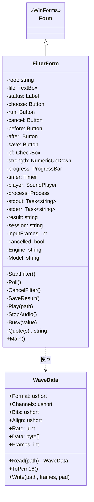

---

## 5. 振る舞い（シーケンス図）

### 5.1 CLI: ノイズ除去（UC1）

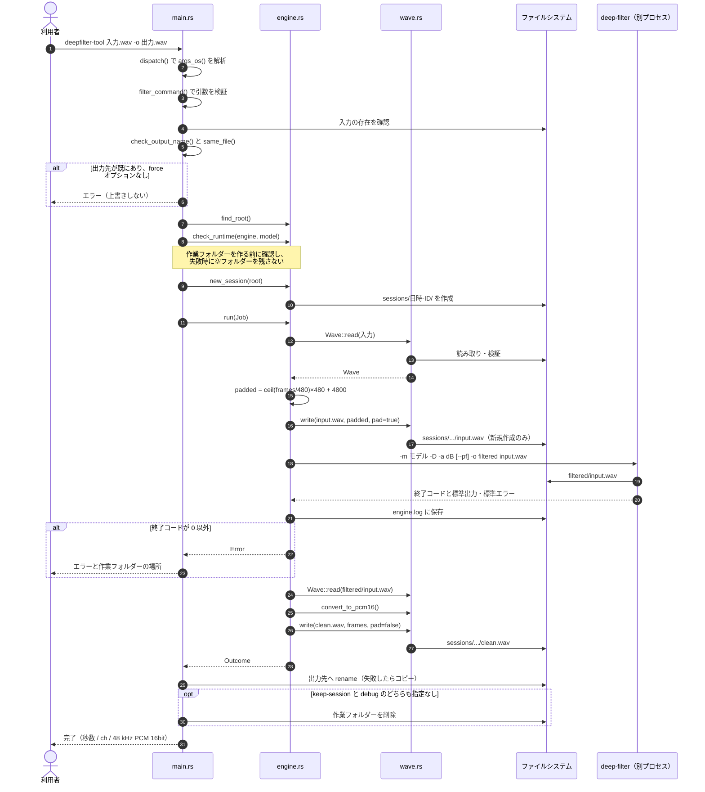

### 5.2 CLI: エンジン導入（UC2）

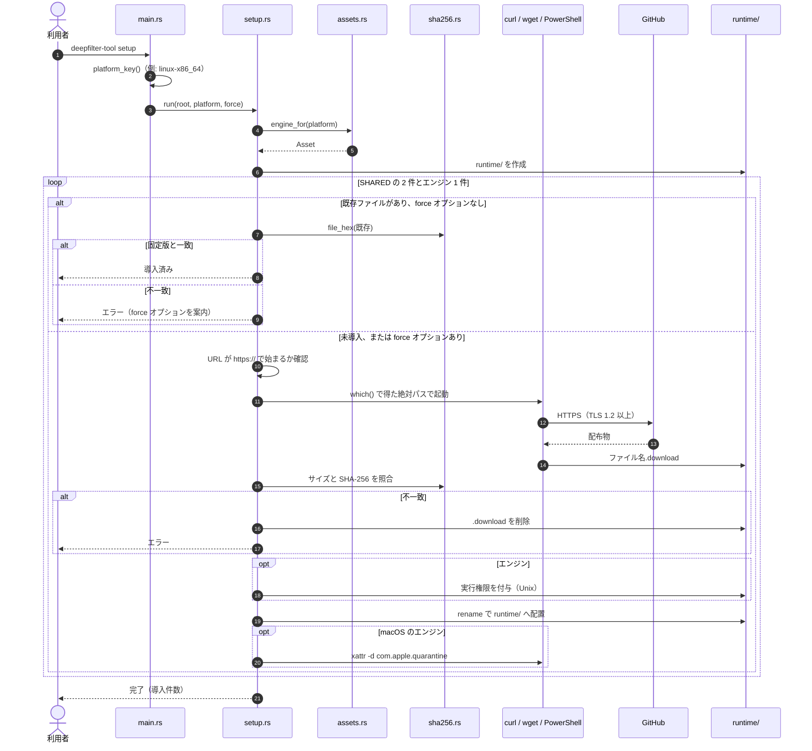

### 5.3 CLI: 導入状態の確認（UC3）

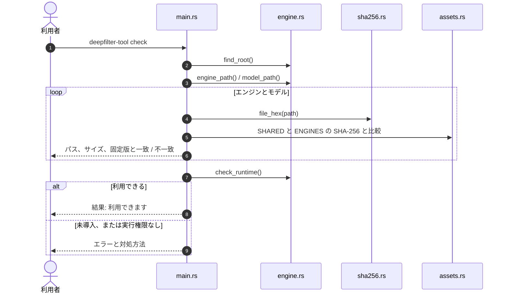

### 5.4 GUI: ノイズ除去（UG1・UG2）

GUI はエンジンを起動したあと、終了を待って処理を止めることはせず、200 ms ごとのタイマーで終了したかどうかを確かめる。終了まで待つと UI スレッドが止まり、処理中は画面が再描画されず、「中止」ボタンも押せなくなるためである。

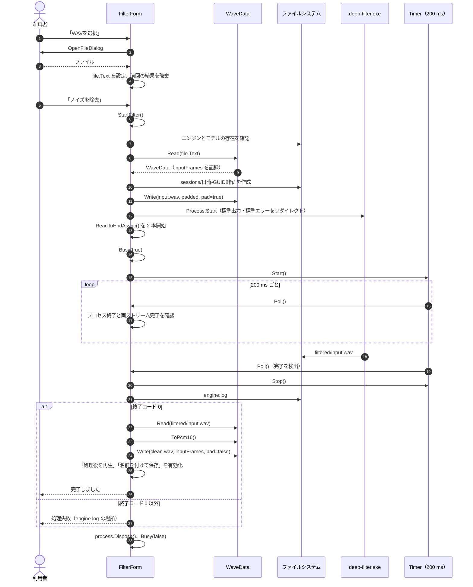

### 5.5 GUI: 中止（UG3）

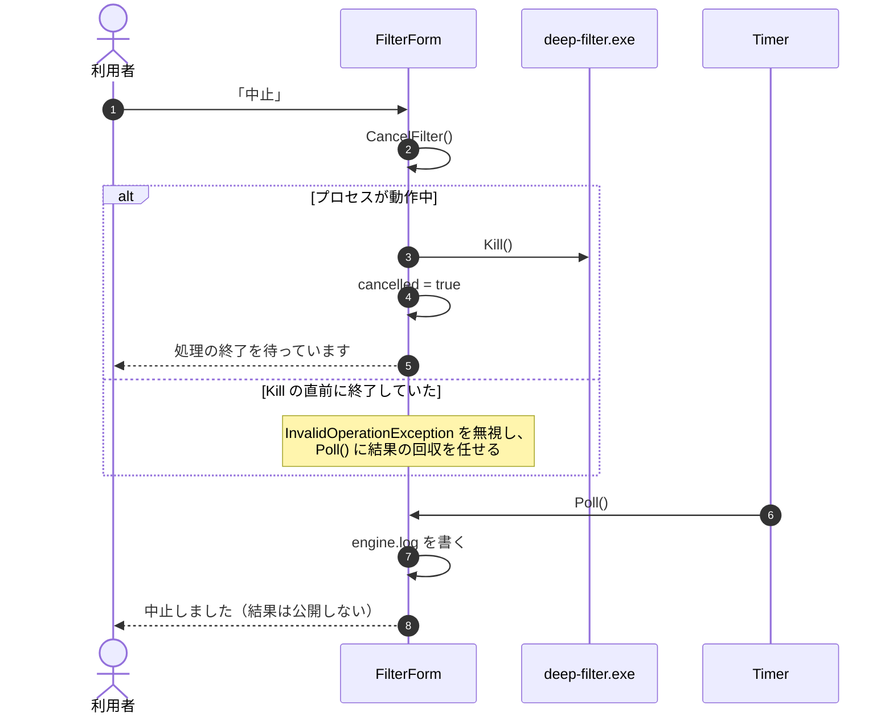

### 5.6 GUI: 保存（UG5）

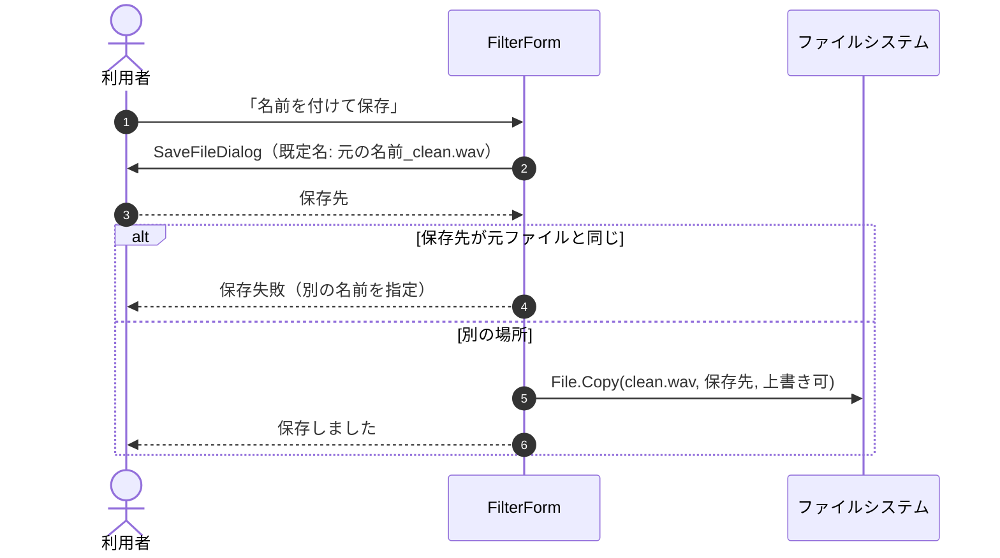

---

## 6. 状態遷移

### 6.1 GUI 画面

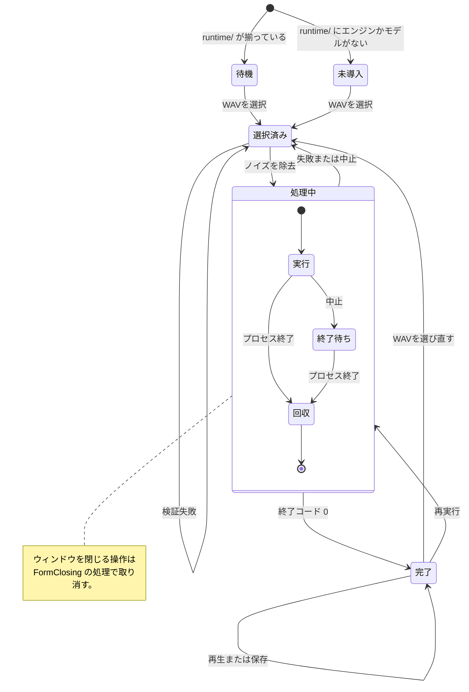

| 状態 | 押せないボタン・設定 |
|---|---|
| 未導入・待機・選択済み | 中止、処理後を再生、名前を付けて保存 |
| 処理中 | WAVを選択、ノイズを除去、抑制量、ポストフィルター、処理後を再生、名前を付けて保存 |
| 完了 | 中止 |

ボタンの有効・無効は、ファイルを選んだかどうかでは切り替わらない。そのため「未導入」や「待機」でも「ノイズを除去」は押せる。押すと `StartFilter()` が、エンジンが未導入であること、または WAV を読めないことをエラーとして表示し、状態は変わらない。

### 6.2 作業フォルダー（`sessions/日時-ID/`）

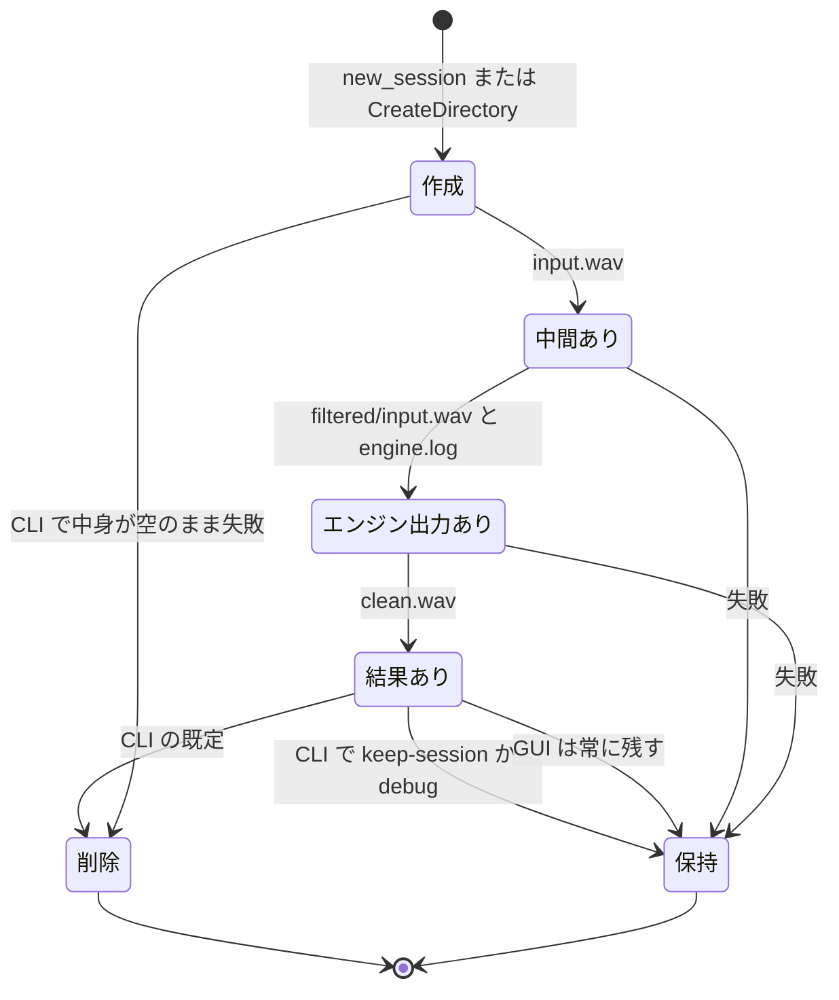

フォルダー名の日時は、CLI が UTC、GUI がローカル時刻。ID は CLI が時刻とプロセス ID から作る 8 桁の 16 進、GUI が GUID の先頭 8 桁。

---

## 7. アクティビティ

### 7.1 WAV の受け入れ判定（`Wave::read` / `WaveData.Read`）

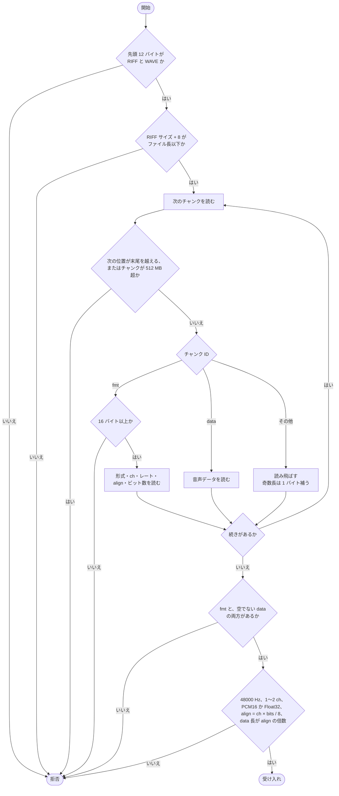

### 7.2 変換の流れ

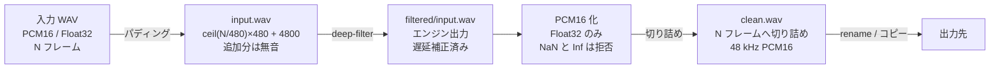

たとえば 48001 フレームの入力は、480 の倍数 48480 へ切り上げてから 4800 を足し、53280 フレームになる。実測では、エンジンはこれに対して 51840 フレームを返し、本ツールが 48001 フレームへ切り詰めた。

---

## 8. 配置

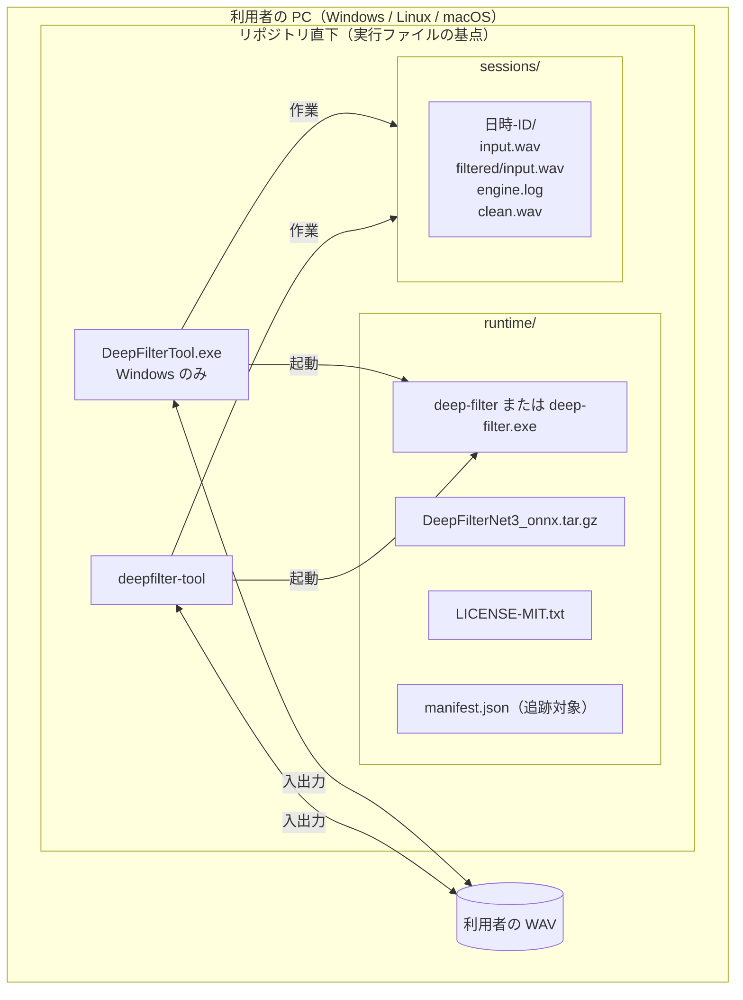

基点（`runtime/` と `sessions/` を置く場所）の決め方:

| 実装 | 規則 |
|---|---|
| CLI | 環境変数 `DEEPFILTER_HOME`。なければ実行ファイルの位置から 4 階層上まで探し、エンジンがある場所、次に `runtime/` がある場所を選ぶ。**カレントディレクトリは探さない** |
| GUI | `AppDomain.CurrentDomain.BaseDirectory`（実行ファイルの位置）だけ |

### 対応プラットフォーム

| キー | エンジン | 備考 |
|---|---|---|
| `windows-x86_64` | `deep-filter.exe` | |
| `linux-x86_64` | `deep-filter` | musl、完全静的 |
| `linux-aarch64` | `deep-filter` | gnu |
| `macos-x86_64` | `deep-filter` | 検疫属性を外す |
| `macos-aarch64` | `deep-filter` | 検疫属性を外す |

いずれも DeepFilterNet v0.5.6。版・URL・バイト数・SHA-256 を `cli/src/assets.rs` に固定している。

---

## 9. データ仕様

### 9.1 WAV の内部表現

`Wave`（`cli/src/wave.rs`）と `WaveData`（`gui/AudioCore.cs`）は同じ形を持つ。

| 項目 | 型 | 値 |
|---|---|---|
| `format` | u16 | 1 = PCM、3 = IEEE Float |
| `channels` | u16 | 1 または 2 |
| `rate` | u32 | 48000 固定 |
| `bits` | u16 | 16（PCM）または 32（Float） |
| `align` | u16 | channels × bits / 8 |
| `data` | バイト列 | サンプル列 |

フレーム数は `data の長さ / align`。

### 9.2 出力 WAV のヘッダー（44 バイト固定）

| オフセット | 長さ | 内容 |
|---|---|---|
| 0 | 4 | `RIFF` |
| 4 | 4 | 36 + データ長 |
| 8 | 8 | `WAVEfmt ` |
| 16 | 4 | 16（fmt チャンク長） |
| 20 | 2 | 形式 |
| 22 | 2 | チャンネル数 |
| 24 | 4 | サンプルレート |
| 28 | 4 | バイトレート（rate × align） |
| 32 | 2 | align |
| 34 | 2 | ビット数 |
| 36 | 4 | `data` |
| 40 | 4 | データ長 |

### 9.3 定数

| 名前 | 値 | 意味 |
|---|---|---|
| `HOP` | 480 | モデルのホップ長。入力をこの境界へ切り上げる |
| `TAIL_PAD` | 4800 | 先読みと端数を吐き出させる余白（0.1 秒） |
| `MAX_CHUNK_BYTES` | 512 MB | 受け入れるチャンクの上限 |
| 抑制の範囲 | 1〜100 dB | 既定は 100 |

### 9.4 Float32 から PCM16 への変換

```
sample = round_ties_even( clamp(v, -1.0, 1.0) × 32767 )
```

C# の `Math.Round` は既定で最近接偶数丸め（ちょうど中間の値を偶数側へ丸める）を行う。Rust 側も `round_ties_even()` で同じ丸めを行う。片方が四捨五入を使うと、ちょうど中間になる値で結果が 1 ずれることがあり、両実装の出力が一致しなくなる。

### 9.5 エンジンの起動引数

```
deep-filter -m <モデル> -D -a <dB> [--pf] [-v] -o <sessions/.../filtered> <sessions/.../input.wav>
```

| 引数 | 意味 |
|---|---|
| `-D` | 遅延補正。末尾パディングと組み合わせて入出力の時間位置を一致させる |
| `-a` | 最大ノイズ抑制（dB） |
| `--pf` | ポストフィルター（強めの除去） |
| `-v` | CLI の `--debug` 時だけ付ける |

CLI は引数を個別の値として渡す。GUI は引数を一つの文字列に組み立て、パスを `"` で囲む。パスに `"` が含まれると囲みがそこで終わり、`\` で終わると閉じの `"` がエスケープされて、どちらも引数の区切りが崩れる。そのため GUI は、この二種類のパスを `Quote()` で拒否する。

---

## 10. エラー処理

### 10.1 方針

| 項目 | CLI | GUI |
|---|---|---|
| 型 | `Error(String)`。`Context` トレイトで文脈を足す | `Exception` |
| 表示先 | 標準エラーに `エラー: …` | 画面の `status` ラベル |
| 終了コード | 失敗時は 1（`ExitCode::FAILURE`） | なし |
| 言語 | 利用者向けの日本語 | 利用者向けの日本語 |

### 10.2 主なエラーと発生箇所

| 分類 | 条件 | CLI | GUI |
|---|---|---|---|
| 引数 | 抑制が 1〜100 の範囲外、不明なオプション、入力が 2 つ以上 | `filter_command` | `NumericUpDown` が範囲を制限 |
| 入力 | ファイルがない、WAV の形式が対象外 | `filter_command`、`Wave::read` | `WaveData.Read` |
| 出力先 | 入力と同じ、既存で `--force` なし、Windows の予約名、末尾が空白か `.`、禁止文字 | `same_file`、`check_output_name` | 保存時に入力と同じなら拒否 |
| 導入 | エンジンかモデルがない、実行権限がない（Unix） | `check_runtime` | 起動時と `StartFilter` |
| エンジン | 起動できない、終了コード 0 以外 | `engine::run` | `Poll` |
| 結果 | NaN / Inf、長さ不足 | `convert_to_pcm16`、`write` | `ToPcm16`、`Write` |
| 導入処理 | HTTPS 以外、取得失敗、サイズや SHA-256 の不一致、既存が固定版と異なる | `setup.rs` | 該当なし |

---

## 11. 非機能要件

### 11.1 セキュリティ

| 対策 | 内容 | 箇所 |
|---|---|---|
| 任意コード実行の防止 | 基点の探索にカレントディレクトリを含めない | `engine::find_root` |
| 供給網 | 外部パッケージはゼロ。配布物は版・URL・サイズ・SHA-256 を固定し、配置前に照合 | `assets.rs`、`setup::verify` |
| 通信 | HTTPS だけ。curl は `--proto =https --tlsv1.2`、wget は `--https-only` | `setup::download` |
| コマンド注入 | シェルを介さない。PowerShell 経路だけ単引用符を二重化 | `setup::powershell_quote` |
| 取得ツールの取り違え | `which()` で得た絶対パスで起動 | `setup::download` |
| 置き換え時の欠落防止 | 一時名で取得し、照合後に `rename` | `setup::install` |
| プライバシー | 音声はネットワークに出ない | 全体 |

### 11.2 データの保全

- 元ファイルは読み取りだけ。出力先が元と同じなら拒否する
- WAV の書き出しは新規作成だけ（`create_new` / `FileMode.CreateNew`）
- 4 GB を超える出力と、掛け算のあふれは書き出す前に拒否する

### 11.3 移植性

- CLI はパスを文字列へ変換せず `OsString` / `Path` のまま扱うので、UTF-8 でないファイル名でも異常終了しない
- エンジンへの入力は常に固定名 `input.wav` にする。利用者のファイル名に含まれる文字は、エンジンの引数に現れない
- CLI は、どの OS で実行しても、Windows で作れない出力名（予約名、末尾の空白と `.`、禁止文字）を拒否する

### 11.4 応答性（GUI）

- エンジンの終了はタイマーで確かめる（理由は 5.4 を参照）
- 標準出力と標準エラーは、起動直後から両方を非同期に読み切る。片方しか読まないと、読まれない側のパイプのバッファーが満ちた時点でエンジンの書き込みが止まり、処理が終わらなくなる

---

## 12. 品質保証（CI）

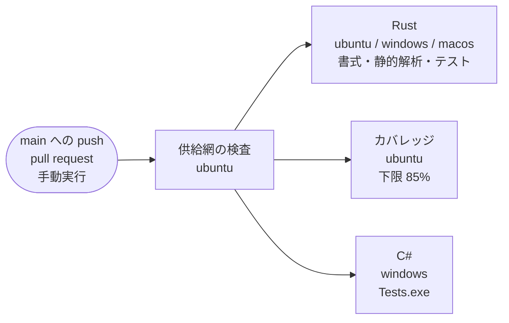

| ジョブ | 検査内容 |
|---|---|
| 供給網の検査 | `Cargo.lock` のパッケージ数が 1、`[dependencies]` が空、`manifest.json` の取得元が公式だけ、第三者アクションがコミット SHA で固定 |
| Rust | 書式、静的解析、エンジンを導入したうえでの単体・統合テスト（3 OS） |
| カバレッジ | `cargo-llvm-cov`（SHA-256 を照合して取得）で 85% 以上 |
| C# | `Tests.exe`（`WaveData` 60 件、画面の読み上げ対応 3 件） |

エンジンと GUI を通す統合テスト `Verify.exe` は、CI では実行しない。C# のジョブにはエンジンを導入する手順がなく、実行時間も長いためである。手元で `gui\build-verify.cmd && Verify.exe` を実行する。テストの内訳と未確認事項は [検証記録](VERIFICATION.md) にある。
